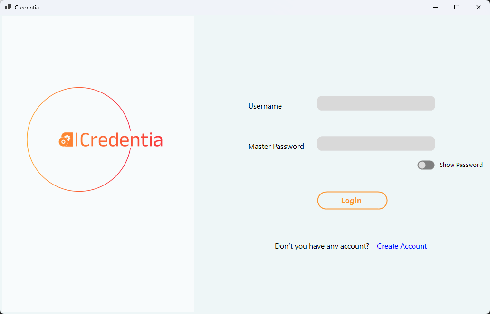
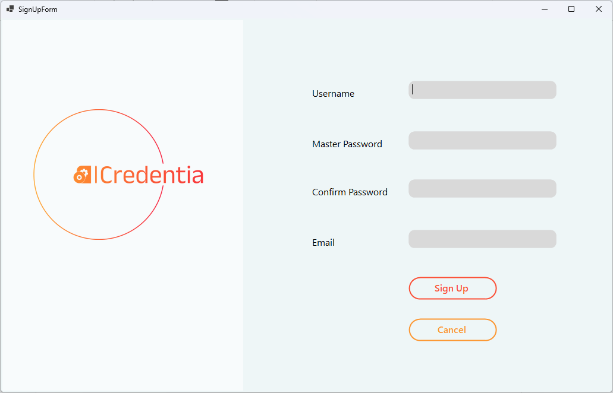
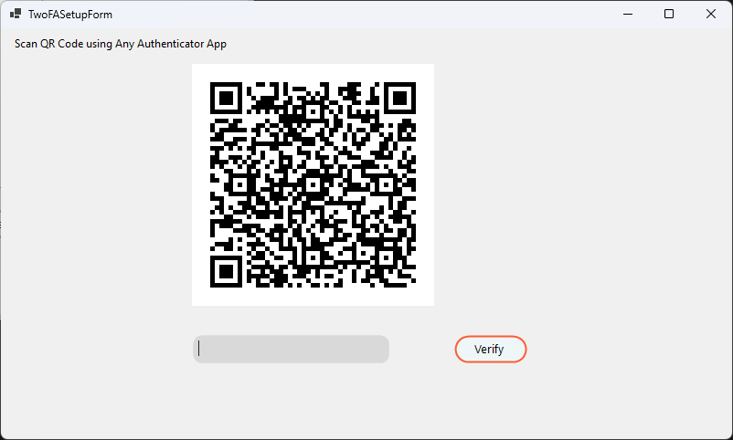
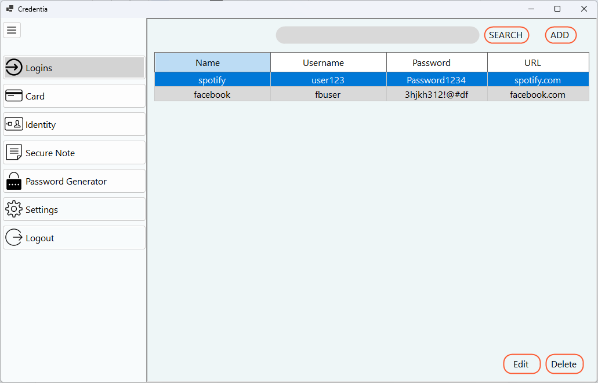
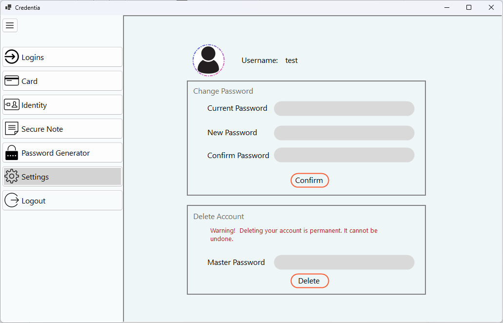

# Credentia - A digital credential storage system

Credentia is a digital credential storage system that allows users to store their credentials in a secure and encrypted manner. The system is designed to be user-friendly and easy to use, with a simple and intuitive interface.

## To Connect Database

- Install MySQl Workbench Community Edition
- change the appsettings.json file to your database connection string (Change Server, Port, Username and Password).

## Screenshots

### Login Page

## Signup Page

## 2FA setup page

## Home Page

## Settings Page

## Nuget Packages

- Dapper
- BCrypt.Net-Next
- Microsoft.Extensions.Configuration.Json
- MySql.Data
- OATH.Net
- Otp.NET
- QRCoder

Todo:

## UI

- [x] Login Page
- [x] 2FA Page
- [x] Create New User Account Page
- [x] Side Menu Bar
- [x] Home Page
- [x] Card Page
- [x] Identity Page
- [x] Secure Note Page
- [x] Password Generator Page
- [x] Settings Page
- [x] Empty State Page
- [ ] Loading Page
- [ ] Animation and Styling
- [ ] Light and Dark Mode
- [x] Edit/Add Page
- [x] Delete Page
- [x] Profile Page (Can be included in settings)
- [x] Implement Search

## Backend

- [x] User Authentication
- [x] Multi User Login System
- [x] Hashing
- [x] Encryption and Decryption
- [x] Database
- [ ] Password Strength
- [x] 2FA
- [x] Password Generator
- [x] Search
